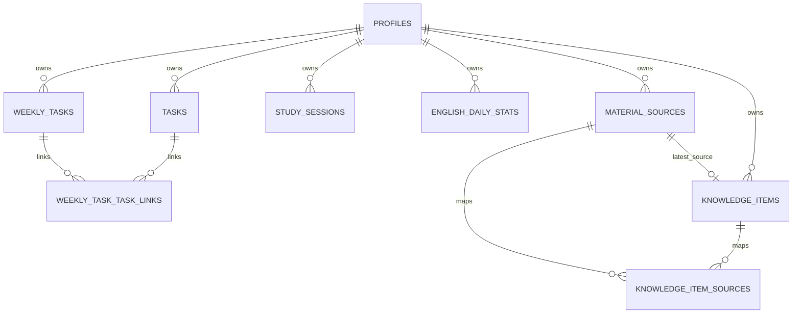
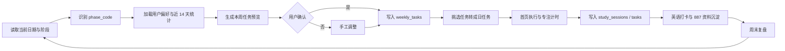

# bit-887-study-dashboard vNext 实施包

## 目标

在不推翻现有 Next.js App Router + Supabase + Tailwind 架构的前提下，完成以下升级：

- 新增每周任务系统，支持手工添加和按阶段计划自动生成
- 强化英语页为词汇打卡中心，支持连续打卡、统计图和成就反馈
- 新增英语语法参考页，以静态内容组织完整备考语法框架
- 强化 887 模块，新增资料源管理、知识卡片笔记、可选附件与 Markdown 导出
- 保持现有首页、任务页、计划页、887 概览、复盘、集训营、错题与总览页可继续使用

## 现有兼容边界

- 保留 `tasks` 作为日任务执行层
- 保留 `study_sessions` 作为专注记录
- 保留 `english_daily_stats`，不另起一套词汇打卡表
- 保留 `/english` 和 `/887` 入口路由，避免打断现有导航
- 保留 `knowledge_cards` 表，后续用作“从知识笔记生成记忆卡片”的派生层
- 语法参考页优先使用仓库内静态文件，不强制入库

## 数据模型总览

| 表名 | 类型 | 作用 | 状态 | 关键字段 |
|---|---|---|---|---|
| profiles | 现有表 | 用户资料 | 现有，建议扩展 | study_preferences |
| tasks | 现有表 | 日任务执行层 | 现有 | subject, title, date, status |
| study_sessions | 现有表 | 专注/学习时长记录 | 现有 | subject, started_at, minutes |
| english_daily_stats | 现有表 | 词汇打卡日统计 | 现有，建议增强 | date, new_words, reviewed_words, accuracy |
| weekly_tasks | 新表 | 周任务计划层 | 新增 | week_start_date, source_type, priority |
| weekly_task_task_links | 新表 | 周任务与日任务关联 | 新增 | weekly_task_id, task_id |
| material_sources | 新表 | 原始资料源登记 | 新增 | source_kind, title, storage_path, ocr_text |
| knowledge_items | 新表 | 结构化笔记/知识卡片 | 新增 | subject, module, title, content_md, tags |
| knowledge_item_sources | 新表 | 知识项与资料源关系 | 新增 | knowledge_item_id, material_source_id |
| knowledge_cards | 现有表 | 记忆卡片/间隔重复 | 现有，保留 | front, back, difficulty |

## SQL migrations

### 迁移文件建议命名

- `20260609000100_add_weekly_tasks.sql`
- `20260609000200_add_material_sources_and_knowledge_items.sql`
- `20260609000300_extend_english_daily_stats.sql`

### add_weekly_tasks.sql

```sql
alter table public.profiles
  add column if not exists study_preferences jsonb not null default '{}'::jsonb;

create table if not exists public.weekly_tasks (
  id uuid primary key default gen_random_uuid(),
  user_id uuid not null references auth.users(id) on delete cascade,
  created_at timestamptz not null default now(),
  updated_at timestamptz not null default now(),
  week_start_date date not null,
  subject text not null check (subject in ('math', 'english', 'politics', 'professional_887')),
  title text not null,
  description text,
  source_type text not null default 'manual' check (source_type in ('manual', 'auto')),
  phase_code text not null default 'foundation',
  status text not null default 'todo' check (status in ('todo', 'doing', 'done', 'skipped')),
  priority smallint not null default 3 check (priority between 1 and 5),
  estimated_minutes integer not null default 60 check (estimated_minutes > 0),
  planned_sessions smallint not null default 1 check (planned_sessions > 0),
  due_date date,
  generated_batch_id uuid,
  metadata jsonb not null default '{}'::jsonb
);

create table if not exists public.weekly_task_task_links (
  weekly_task_id uuid not null references public.weekly_tasks(id) on delete cascade,
  task_id uuid not null references public.tasks(id) on delete cascade,
  user_id uuid not null references auth.users(id) on delete cascade,
  created_at timestamptz not null default now(),
  primary key (weekly_task_id, task_id)
);

create index if not exists weekly_tasks_user_week_idx
  on public.weekly_tasks(user_id, week_start_date);

create index if not exists weekly_tasks_user_week_subject_idx
  on public.weekly_tasks(user_id, week_start_date, subject);

create unique index if not exists weekly_tasks_user_week_auto_unique
  on public.weekly_tasks(user_id, week_start_date, subject, title)
  where source_type = 'auto';

create index if not exists weekly_task_task_links_user_idx
  on public.weekly_task_task_links(user_id, created_at);

drop trigger if exists set_weekly_tasks_updated_at on public.weekly_tasks;
create trigger set_weekly_tasks_updated_at
before update on public.weekly_tasks
for each row execute function public.set_updated_at();

alter table public.weekly_tasks enable row level security;
alter table public.weekly_task_task_links enable row level security;

grant select, insert, update, delete on public.weekly_tasks to authenticated;
grant select, insert, update, delete on public.weekly_task_task_links to authenticated;

drop policy if exists "weekly_tasks_select_own" on public.weekly_tasks;
drop policy if exists "weekly_tasks_insert_own" on public.weekly_tasks;
drop policy if exists "weekly_tasks_update_own" on public.weekly_tasks;
drop policy if exists "weekly_tasks_delete_own" on public.weekly_tasks;

create policy "weekly_tasks_select_own"
on public.weekly_tasks for select to authenticated
using ((select auth.uid()) = user_id);

create policy "weekly_tasks_insert_own"
on public.weekly_tasks for insert to authenticated
with check ((select auth.uid()) = user_id);

create policy "weekly_tasks_update_own"
on public.weekly_tasks for update to authenticated
using ((select auth.uid()) = user_id)
with check ((select auth.uid()) = user_id);

create policy "weekly_tasks_delete_own"
on public.weekly_tasks for delete to authenticated
using ((select auth.uid()) = user_id);

drop policy if exists "weekly_task_task_links_select_own" on public.weekly_task_task_links;
drop policy if exists "weekly_task_task_links_insert_own" on public.weekly_task_task_links;
drop policy if exists "weekly_task_task_links_update_own" on public.weekly_task_task_links;
drop policy if exists "weekly_task_task_links_delete_own" on public.weekly_task_task_links;

create policy "weekly_task_task_links_select_own"
on public.weekly_task_task_links for select to authenticated
using ((select auth.uid()) = user_id);

create policy "weekly_task_task_links_insert_own"
on public.weekly_task_task_links for insert to authenticated
with check ((select auth.uid()) = user_id);

create policy "weekly_task_task_links_update_own"
on public.weekly_task_task_links for update to authenticated
using ((select auth.uid()) = user_id)
with check ((select auth.uid()) = user_id);

create policy "weekly_task_task_links_delete_own"
on public.weekly_task_task_links for delete to authenticated
using ((select auth.uid()) = user_id);
```

### add_material_sources_and_knowledge_items.sql

```sql
create table if not exists public.material_sources (
  id uuid primary key default gen_random_uuid(),
  user_id uuid not null references auth.users(id) on delete cascade,
  created_at timestamptz not null default now(),
  updated_at timestamptz not null default now(),
  source_kind text not null check (source_kind in ('manual', 'screenshot', 'pdf', 'ocr_text', 'url', 'note')),
  subject text not null check (subject in ('english', 'professional_887', 'general')),
  title text not null,
  source_label text,
  source_url text,
  storage_bucket text,
  storage_path text,
  file_mime_type text,
  file_size_bytes bigint,
  ocr_status text not null default 'pending' check (ocr_status in ('pending', 'done', 'failed', 'not_needed')),
  ocr_text text,
  copyright_scope text not null default 'private_notes_only' check (copyright_scope in ('private_notes_only', 'personal_copy', 'unknown')),
  is_private boolean not null default true,
  metadata jsonb not null default '{}'::jsonb
);

create table if not exists public.knowledge_items (
  id uuid primary key default gen_random_uuid(),
  user_id uuid not null references auth.users(id) on delete cascade,
  created_at timestamptz not null default now(),
  updated_at timestamptz not null default now(),
  subject text not null check (subject in ('english', 'professional_887', 'general')),
  module text not null,
  topic text,
  title text not null,
  slug text,
  summary text,
  content_md text not null,
  tags text[] not null default '{}',
  difficulty smallint not null default 3 check (difficulty between 1 and 5),
  review_state text not null default 'new' check (review_state in ('new', 'learning', 'stable', 'needs_revision')),
  latest_source_id uuid references public.material_sources(id) on delete set null,
  metadata jsonb not null default '{}'::jsonb
);

create table if not exists public.knowledge_item_sources (
  knowledge_item_id uuid not null references public.knowledge_items(id) on delete cascade,
  material_source_id uuid not null references public.material_sources(id) on delete cascade,
  user_id uuid not null references auth.users(id) on delete cascade,
  created_at timestamptz not null default now(),
  primary key (knowledge_item_id, material_source_id)
);

create index if not exists material_sources_user_subject_idx
  on public.material_sources(user_id, subject, created_at desc);

create index if not exists material_sources_user_ocr_idx
  on public.material_sources(user_id, ocr_status, created_at desc);

create index if not exists knowledge_items_user_subject_module_idx
  on public.knowledge_items(user_id, subject, module, created_at desc);

create index if not exists knowledge_items_tags_gin_idx
  on public.knowledge_items using gin(tags);

drop trigger if exists set_material_sources_updated_at on public.material_sources;
create trigger set_material_sources_updated_at
before update on public.material_sources
for each row execute function public.set_updated_at();

drop trigger if exists set_knowledge_items_updated_at on public.knowledge_items;
create trigger set_knowledge_items_updated_at
before update on public.knowledge_items
for each row execute function public.set_updated_at();

alter table public.material_sources enable row level security;
alter table public.knowledge_items enable row level security;
alter table public.knowledge_item_sources enable row level security;

grant select, insert, update, delete on public.material_sources to authenticated;
grant select, insert, update, delete on public.knowledge_items to authenticated;
grant select, insert, update, delete on public.knowledge_item_sources to authenticated;

drop policy if exists "material_sources_select_own" on public.material_sources;
drop policy if exists "material_sources_insert_own" on public.material_sources;
drop policy if exists "material_sources_update_own" on public.material_sources;
drop policy if exists "material_sources_delete_own" on public.material_sources;

create policy "material_sources_select_own"
on public.material_sources for select to authenticated
using ((select auth.uid()) = user_id);

create policy "material_sources_insert_own"
on public.material_sources for insert to authenticated
with check ((select auth.uid()) = user_id);

create policy "material_sources_update_own"
on public.material_sources for update to authenticated
using ((select auth.uid()) = user_id)
with check ((select auth.uid()) = user_id);

create policy "material_sources_delete_own"
on public.material_sources for delete to authenticated
using ((select auth.uid()) = user_id);

drop policy if exists "knowledge_items_select_own" on public.knowledge_items;
drop policy if exists "knowledge_items_insert_own" on public.knowledge_items;
drop policy if exists "knowledge_items_update_own" on public.knowledge_items;
drop policy if exists "knowledge_items_delete_own" on public.knowledge_items;

create policy "knowledge_items_select_own"
on public.knowledge_items for select to authenticated
using ((select auth.uid()) = user_id);

create policy "knowledge_items_insert_own"
on public.knowledge_items for insert to authenticated
with check ((select auth.uid()) = user_id);

create policy "knowledge_items_update_own"
on public.knowledge_items for update to authenticated
using ((select auth.uid()) = user_id)
with check ((select auth.uid()) = user_id);

create policy "knowledge_items_delete_own"
on public.knowledge_items for delete to authenticated
using ((select auth.uid()) = user_id);

drop policy if exists "knowledge_item_sources_select_own" on public.knowledge_item_sources;
drop policy if exists "knowledge_item_sources_insert_own" on public.knowledge_item_sources;
drop policy if exists "knowledge_item_sources_update_own" on public.knowledge_item_sources;
drop policy if exists "knowledge_item_sources_delete_own" on public.knowledge_item_sources;

create policy "knowledge_item_sources_select_own"
on public.knowledge_item_sources for select to authenticated
using ((select auth.uid()) = user_id);

create policy "knowledge_item_sources_insert_own"
on public.knowledge_item_sources for insert to authenticated
with check ((select auth.uid()) = user_id);

create policy "knowledge_item_sources_update_own"
on public.knowledge_item_sources for update to authenticated
using ((select auth.uid()) = user_id)
with check ((select auth.uid()) = user_id);

create policy "knowledge_item_sources_delete_own"
on public.knowledge_item_sources for delete to authenticated
using ((select auth.uid()) = user_id);

insert into storage.buckets (id, name, public, file_size_limit, allowed_mime_types)
values (
  'study-materials-private',
  'study-materials-private',
  false,
  10485760,
  array['image/png', 'image/jpeg', 'application/pdf']
)
on conflict (id) do nothing;

drop policy if exists "study_materials_private_select_own" on storage.objects;
drop policy if exists "study_materials_private_insert_own" on storage.objects;
drop policy if exists "study_materials_private_update_own" on storage.objects;
drop policy if exists "study_materials_private_delete_own" on storage.objects;

create policy "study_materials_private_select_own"
on storage.objects for select to authenticated
using (
  bucket_id = 'study-materials-private'
  and (storage.foldername(name))[1] = (select auth.uid())::text
);

create policy "study_materials_private_insert_own"
on storage.objects for insert to authenticated
with check (
  bucket_id = 'study-materials-private'
  and (storage.foldername(name))[1] = (select auth.uid())::text
);

create policy "study_materials_private_update_own"
on storage.objects for update to authenticated
using (
  bucket_id = 'study-materials-private'
  and (storage.foldername(name))[1] = (select auth.uid())::text
)
with check (
  bucket_id = 'study-materials-private'
  and (storage.foldername(name))[1] = (select auth.uid())::text
);

create policy "study_materials_private_delete_own"
on storage.objects for delete to authenticated
using (
  bucket_id = 'study-materials-private'
  and (storage.foldername(name))[1] = (select auth.uid())::text
);
```

### extend_english_daily_stats.sql

```sql
alter table public.english_daily_stats
  add column if not exists target_new_words integer check (target_new_words is null or target_new_words >= 0),
  add column if not exists target_reviewed_words integer check (target_reviewed_words is null or target_reviewed_words >= 0),
  add column if not exists check_in_status text not null default 'done' check (check_in_status in ('done', 'partial', 'missed'));

create unique index if not exists english_daily_stats_user_date_app_unique
  on public.english_daily_stats(user_id, date, app_name);
```

## Hooks 与数据访问建议

### 保留并增强 `useTable`

建议增强 `lib/use-table.ts`，新增以下可选参数：

- `limit?: number`
- `range?: { from: number; to: number }`
- `select?: string`
- `filters?: Array<{ column: string; op?: 'eq' | 'gte' | 'lte' | 'ilike'; value: unknown }>`
- `upsert?: boolean`

### 新增 hooks

| Hook | 作用 | 推荐实现 |
|---|---|---|
| useWeeklyTasks | 周任务 CRUD、按周加载、批量生成 | 基于 `weekly_tasks` + `weekly_task_task_links` |
| useVocabularyStats | 词汇打卡读取、周/月汇总、streak 计算 | 基于 `english_daily_stats`，统计在 hook 内或 util 中完成 |
| useKnowledgeItems | 知识卡片 CRUD、筛选、导出 | 基于 `knowledge_items` |
| useMaterialSources | 资料源登记、OCR 状态、上传元数据 | 基于 `material_sources` |
| useStudyAnalytics | 仅读取指定时间范围统计，避免全表扫描 | 针对 dashboard 与图表汇总 |

### API 建议

当前项目以浏览器直连 Supabase 为主，因此 API 不宜泛滥。建议仅增加两类 route handler：

- `app/api/export/markdown/route.ts`
  - 生成 Markdown 导出文本
  - 如果不想引入服务端 session，可改为前端组装 Blob 下载
- `app/api/import/ocr/route.ts`
  - 可选
  - 只有在接入 OCR 服务时才实现
  - 若 OCR 未配置，则 UI 回退为“手工粘贴 OCR 文本”

## 页面与路由设计

| 路由 | 页面作用 | 状态 | 数据来源 |
|---|---|---|---|
| / | 今日进度首页 | 保留 | tasks, study_sessions |
| /plan | 阶段计划页 | 保留 | 静态 `lib/plan.ts` |
| /tasks | 日任务 CRUD | 保留 | tasks |
| /english | 词汇打卡总入口 | 改造 | english_daily_stats, tasks |
| /english/grammar | 英语语法参考页 | 新增 | `data/grammar/*.ts` 或 `content/grammar/*.md` |
| /887 | 专业课概览页 | 改造 | tasks, weekly_tasks |
| /887/notes | 887 知识卡片页 | 新增 | knowledge_items |
| /887/materials | 资料源与导入页 | 新增 | material_sources |
| /weekly | 每周任务页 | 新增 | weekly_tasks |
| /dashboard | 全局统计页 | 改造 | tasks, study_sessions, english_daily_stats |
| /api/export/markdown | 导出 Markdown | 可选新增 | knowledge_items, material_sources |
| /api/import/ocr | OCR 接口 | 可选新增 | material_sources |

## 组件映射到现有组件

| 新功能 | 直接复用组件 | 新增组件建议 |
|---|---|---|
| 每周任务页 | PageHeader, Card, Field, Badge, ProgressRing, Protected | WeeklyTaskCard, WeeklyTaskEditor, WeekSwitcher |
| 词汇打卡页 | PageHeader, Card, Field, ProgressRing | MiniBarChart, SparklineChart, StreakBadge |
| 语法参考页 | PageHeader, Card, Badge | GrammarSidebar, GrammarSection, GrammarSearchBox |
| 887 笔记页 | PageHeader, Card, Field, Badge, Protected | KnowledgeItemCard, KnowledgeItemEditor |
| 资料源页 | PageHeader, Card, Field, Protected | SourceImportDrawer, OcrReviewPanel, AttachmentList |
| 导出 | ghostButtonClass, buttonClass | MarkdownExportButton |

建议顺手抽出两个共用组件：

- `MetricCard`
- `SectionTabs`

也建议把重复逻辑提到工具层：

- `getWeekStart(dateISO)` 移入 `lib/date.ts`
- `calculateStreak()` 移入 `lib/date.ts` 或 `lib/stats.ts`

## UI/UX 线框描述

### 每周任务页

布局：

- 顶部：周起始日期、当前阶段、完成率、自动生成按钮、手动新增按钮
- 左侧主区：按科目分组的周任务卡片列表
- 右侧侧栏：本周重点、生成规则说明、拖入今日任务按钮
- 底部：本周已转为日任务的链接列表

核心交互：

- 点击“自动生成本周”先弹出预览，不直接写库
- 点击“确认生成”后再插入 `weekly_tasks`
- 每张周任务卡片可：
  - 标记完成
  - 编辑
  - 删除
  - 转成一个或多个日任务
  - 查看关联知识卡片

### 英语词汇打卡页

布局：

- 顶部：累计进度环、今日新词、今日复习、本周新词、本月复习、连续打卡天数
- 中部：两个轻量图
  - 最近 7 天柱状图
  - 最近 30 天折线图
- 下部左侧：今日打卡表单
- 下部右侧：最近 14 条记录

成就反馈建议：

- 连续 3 天、7 天、14 天、21 天显示成就文案
- 达到当日目标时显示“今日目标完成”
- 新词/复习连续上升时显示“趋势向上”

### 英语语法参考页

布局：

- 左侧：语法目录树
- 右侧：内容区
- 顶部：搜索框、目录折叠开关
- 内容区每节含：
  - 核心规则
  - 常考提醒
  - 例句
  - 长难句拆解
  - 易错点

语法目录建议：

- 句子成分与基本句型
- 名词、冠词、代词
- 动词时态与语态
- 非谓语动词
- 情态动词与虚拟语气
- 定语从句
- 名词性从句
- 状语从句
- 主谓一致、倒装、强调、省略、否定与比较
- 长难句拆解方法
- 翻译常见句法处理

### 887 概览与笔记页

`/887` 保持概览，新增二级链接：

- 任务概览
- 知识卡片
- 资料源

`/887/notes` 卡片布局建议：

- 卡片头：模块、标签、难度、最近来源
- 卡片体：标题、摘要、正文预览
- 卡片尾：加入本周任务、生成复习卡片、编辑、导出

`/887/materials` 建议三列：

- 左列：资料源列表
- 中列：OCR 文本 / 解析结果
- 右列：生成的知识项预览

## 每周任务自动生成算法

### 输入

- 当前日期
- `lib/plan.ts` 中的 `foundationPhases`, `weeklyCadence`, `dailyRhythm`
- `profiles.study_preferences`
- 最近 14 天 `tasks`, `study_sessions`, `english_daily_stats`
- 用户已存在但未完成的 `weekly_tasks`
- 可选：知识库覆盖率（是否已有对应 887 知识项）

### 关键规则

1. 先根据日期定位阶段
   - 2026-06-06 到 2026-06-30 为“补地基”
   - 2026-07-01 到 2026-07-31 为“基础一轮”
   - 2026-08-01 到 2026-08-31 为“基础收口”
   - 2026-09-01 到 2026-10-31 为“强化转段”

2. 基于阶段分配学科权重
   - 补地基：数学 35，英语 25，887 30，政治 10
   - 基础一轮：数学 35，英语 20，887 35，政治 10
   - 基础收口：数学 30，英语 20，887 40，政治 10
   - 强化转段：数学 30，英语 20，887 35，政治 15

3. 使用每周节奏安排任务落点
   - 周一/三/五：高数主线 + 半导体物理
   - 周二/四：线代/概率预热 + 电子技术基础
   - 周六：小测与补漏
   - 周日：轻复盘与资料整理

4. 自动生成时先检测重复
   - 同周相同 subject + title 的 auto 任务不重复插入

5. 处理未完成结转
   - 上周未完成任务最多结转 3 条
   - 低优先级未完成任务不自动结转

6. 词汇适配规则
   - 若最近 7 天打卡少于 4 天，则本周新增“恢复连续打卡”任务
   - 若最近 7 天平均正确率低于 75，则新词目标下降 20%，复习目标上升 20%

7. 887 资料整理规则
   - 若最近 14 天没有新增 `knowledge_items`，自动加 1 条“资料整理与笔记沉淀”任务

### 样例输出

```json
[
  {
    "week_start_date": "2026-06-08",
    "subject": "math",
    "title": "高数基础一小节闭环",
    "description": "极限与导数：概念、例题、基础题一组",
    "source_type": "auto",
    "phase_code": "foundation",
    "priority": 5,
    "estimated_minutes": 180,
    "planned_sessions": 2,
    "due_date": "2026-06-10",
    "metadata": {
      "generator": "phase-plan-v1",
      "cadence_slot": "周一/三/五",
      "topic_hint": "极限、导数"
    }
  },
  {
    "week_start_date": "2026-06-08",
    "subject": "english",
    "title": "词汇连续打卡",
    "description": "本周至少完成 6 天词汇打卡；每日新词 50，复习 100",
    "source_type": "auto",
    "phase_code": "foundation",
    "priority": 5,
    "estimated_minutes": 210,
    "planned_sessions": 6,
    "due_date": "2026-06-14",
    "metadata": {
      "generator": "phase-plan-v1",
      "target_new_words": 50,
      "target_reviewed_words": 100
    }
  },
  {
    "week_start_date": "2026-06-08",
    "subject": "professional_887",
    "title": "半导体物理主线整理",
    "description": "能带、载流子、PN 结三部分建立知识卡片",
    "source_type": "auto",
    "phase_code": "foundation",
    "priority": 5,
    "estimated_minutes": 180,
    "planned_sessions": 3,
    "due_date": "2026-06-13",
    "metadata": {
      "generator": "phase-plan-v1",
      "module": "半导体物理"
    }
  }
]
```

## 887 知识项模板

### JSON 模板

```json
{
  "subject": "professional_887",
  "module": "半导体物理",
  "topic": "PN结",
  "title": "PN结的伏安特性、结电容与击穿",
  "summary": "整理 PN 结在正偏、反偏下的电流特性，结电容类型与击穿机制。",
  "content_md": "## 核心概念\n...\n## 公式\n...\n## 易错点\n...\n## 例题\n...",
  "tags": ["PN结", "半导体物理", "基础主线"],
  "difficulty": 3,
  "review_state": "learning",
  "metadata": {
    "source_level": "参考整理",
    "source_note": "待用户用官方附件二次校对"
  }
}
```

### Markdown 模板

```md
# PN结的伏安特性、结电容与击穿

元信息
- 科目：专业课 887
- 模块：半导体物理
- 主题：PN结
- 标签：PN结, 半导体物理, 基础主线
- 难度：3
- 来源等级：参考整理

## 核心概念
- 正偏电流的形成
- 反偏漏电与温升影响
- 势垒区变化与电容变化

## 关键公式
- 二极管电流方程
- 结电容近似表达式
- 击穿相关条件

## 常考问法
- 为什么正偏时电流迅速增大
- 扩散电容与势垒电容的区别
- 齐纳击穿与雪崩击穿的区别

## 易错点
- 结电容类型与偏置条件混淆
- 电流方向与载流子移动方向混淆
- 物理意义会背但不会结合公式解释

## 例题
### 例题一
题干：
解法：
结论：

## 关联任务
- 本周任务：半导体物理主线整理
- 日任务：PN结基础题 3 道
```

## 资料采集与整理工作流

### 原则

- 先做“索引和摘要”，再做“全文存档”
- 手工文字输入优先，截图/PDF 上传为可选
- 购买课程截图和笔记默认仅作私有整理，不公开展示原图
- OCR 结果必须可人工校对，不允许一键入库直出成知识卡

### 资料来源类型

- Waterwood App 截图
- 已购买课程笔记
- PDF 讲义
- 自己手写整理后转录的文本
- 网页链接
- OCR 文本粘贴

### 流程

1. 登记资料源
   - 记录标题、模块、来源说明、是否私有
2. 可选上传附件
   - 截图、PDF 存到私有 bucket
3. OCR 或手工粘贴文本
   - OCR 若不可用，退回到手工摘要
4. 人工切分
   - 按知识点切成原子条目
5. 生成知识项
   - 每个知识项只处理一个主题
6. 绑定来源
   - 一个知识项可对应多个资料源
7. 加标签
   - 模块、难度、题型、阶段
8. 导出 Markdown
   - 按模块和主题排序输出

### Waterwood App 信息整理建议

根据用户手头应用目录，可优先按以下桶整理：

- 基础课程
- 强化课程
- 冲刺课程
- 真题课程
- 直播课程
- 习题课程
- 院校划重点课程

每个桶内至少整理：

- 课程名
- 讲次
- 对应知识点
- 用户掌握度
- 是否需要转成本周任务
- 是否需要切成知识项

## 英语语法参考页内容结构建议

- 句子成分与五大基本句型
- 谓语动词时态体系
- 被动语态与主动态转换
- 非谓语动词
  - 不定式
  - 动名词
  - 分词
- 名词性从句
  - 主语从句
  - 宾语从句
  - 表语从句
  - 同位语从句
- 定语从句
- 状语从句
- 虚拟语气
- 倒装、强调、省略、否定、比较、主谓一致
- 长难句拆解
  - 找主干
  - 识别从句
  - 处理插入与修饰
  - 识别指代
  - 翻译重组

## Markdown 导出格式

最终导出文件建议命名：

- `bit887_materials_export_YYYY-MM-DD.md`

导出结构建议：

```md
# BIT 887 材料导出

导出日期：2026-06-08

## 资料源索引
### [professional_887] Waterwood 基础课程截图整理
- 类型：screenshot
- 私有：true
- OCR 状态：done

## 知识项
### [半导体物理] PN结的伏安特性、结电容与击穿
正文...

### [电子技术基础] BJT 三种工作区与判断条件
正文...

## 本周任务引用
- 半导体物理主线整理
- 电子技术基础器件工作区表

## 待补充清单
- 真题课程目录未录入
- 习题课程讲次未清点
```

## 性能与风险控制

- 所有统计页不要再默认读取全年全量数据
- `dashboard`、`weekly`、`materials` 必须加日期范围或分页
- 图片不要转 base64 存数据库
- 默认不公开附件
- OCR 作为可选能力，不应卡住手工记录主流程
- grammar 页采用静态内容，避免数据库读放大
- `weekly_tasks` 自动生成必须支持预览和幂等，避免重复插入

## 测试与部署

### 本地

```bash
npm install
cp .env.example .env.local
# 填 NEXT_PUBLIC_SUPABASE_URL 和 NEXT_PUBLIC_SUPABASE_ANON_KEY

supabase start
supabase db reset

npm run lint
npm run typecheck
npm run build
npm run dev
```

### 手工测试清单

- 未登录时，`/weekly`、`/english`、`/887/notes`、`/887/materials` 是否被正确保护
- 登录后：
  - 能否自动生成一周任务并确认写库
  - 能否手工添加/编辑/删除周任务
  - 能否把周任务转成日任务
  - 英语打卡是否能新增、编辑、删除
  - streak 是否正确
  - 7 天柱状图与 30 天趋势图是否正确
  - grammar 页面目录跳转是否正常
  - 材料源能否手工创建
  - 附件上传失败时是否有友好提示
  - OCR 未配置时是否显示“手工粘贴文本”
  - Markdown 导出是否可下载

### Vercel

- 导入 GitHub 仓库
- 设置环境变量：
  - `NEXT_PUBLIC_SUPABASE_URL`
  - `NEXT_PUBLIC_SUPABASE_ANON_KEY`
  - `SUPABASE_SERVICE_ROLE_KEY`（仅在服务端导出或 OCR 上传签名时需要）
- 如果存在 route handler 使用服务端密钥，必须保证只在服务端读取，绝不暴露给浏览器
- 使用 Preview 环境先验收，再推 Production

## Mermaid 图

### 数据关系图



### 周计划到执行时间线



## 路线图与工作量

| 优先级 | 任务 | 说明 | 工作量 |
|---|---|---|---|
| P0 | 抽公共 util 与增强 useTable | 提取 getWeekStart、MetricCard、range/limit/filter 能力 | 小 |
| P0 | 迁移 weekly_tasks | 加周计划层与任务链接表 | 中 |
| P0 | 增强 english_daily_stats | 唯一索引、目标字段、streak 逻辑 | 小 |
| P1 | 每周任务页 | 自动生成预览、手工 CRUD、转日任务 | 大 |
| P1 | 英语页升级 | 轻量图、streak、目标完成提示 | 中 |
| P1 | grammar 页 | 静态内容、目录树、搜索 | 中 |
| P2 | 887 笔记页 | knowledge_items CRUD、和周任务联动 | 大 |
| P2 | 资料源页 | material_sources、可选上传、OCR 文本校对 | 大 |
| P2 | Markdown 导出 | 全量导出知识项与资料索引 | 中 |
| P3 | dashboard 优化 | 避免全表扫描、增加时间范围统计 | 中 |
| P3 | README 与部署文档 | 补齐文档、Vercel 说明、迁移说明 | 小 |

## 开放项

下列细节保持开放，不应在第一轮实现中强行写死：

- 精确 UI 文案
- 图片存储提供者，默认可用 Supabase Storage
- OCR 提供者，默认允许未配置时手工粘贴
- 是否要支持知识项公开分享
- 词汇总目标是否继续使用 7941，还是改为用户可配置
